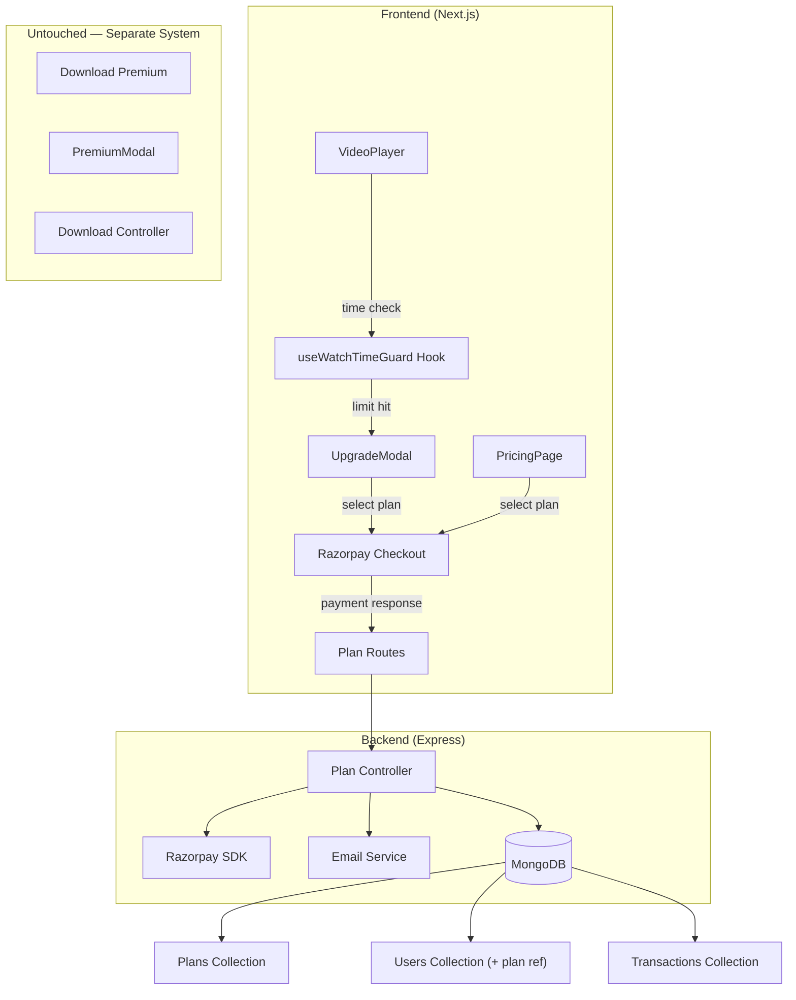
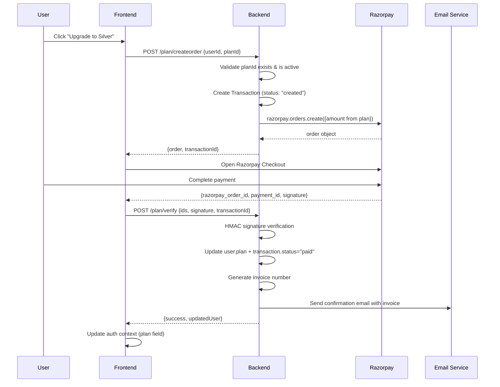

# FlexTube Video Watch-Time Plan System — Architecture & Implementation Plan

> [!IMPORTANT]
> **Scope boundary**: This system ONLY controls video playback time limits. The existing download premium (`isPremium`, `PremiumModal`, download limits) is a **completely separate** system and will NOT be modified.

## 1. System Architecture



**Two independent systems coexist:**
- **Watch-time plans** (Free/Bronze/Silver/Gold) → new `plan` field on user
- **Download premium** (`isPremium` boolean) → existing system, unchanged

---

## 2. Database Schema Changes

### 2a. [NEW] `server/Modals/Plan.js`

```js
{
  name: String,              // "free", "bronze", "silver", "gold"
  displayName: String,       // "Bronze Plan"
  price: Number,             // amount in paise (1000 = ₹10), 0 for free
  currency: String,          // "INR"
  watchLimitMinutes: Number, // 5, 7, 10, null (null = unlimited for gold)
  features: [String],        // ["7 min watch time", "HD quality"]
  color: String,             // "#CD7F32" for badge/card theming
  isActive: Boolean,         // soft-disable plans
  order: Number,             // display sort order (0=free, 1=bronze, etc.)
}
```

### 2b. [NEW] `server/Modals/Transaction.js`

```js
{
  userId: ObjectId → user,
  planId: ObjectId → plan,
  razorpayOrderId: String,
  razorpayPaymentId: String,
  razorpaySignature: String,
  amount: Number,            // in paise
  currency: String,
  status: String,            // "created", "paid", "failed"
  invoiceNumber: String,     // "FT-20260509-0001"
  createdAt: Date,
}
```

### 2c. [MODIFY] `server/Modals/Auth.js` — ADD plan field (keep isPremium untouched)

```diff
  isPremium: { type: Boolean, default: false },     // ← STAYS for downloads
  premiumSince: { type: Date, default: null },      // ← STAYS for downloads
+ plan: { type: mongoose.Schema.Types.ObjectId, ref: "plan", default: null },
+ planActivatedAt: { type: Date, default: null },
```

When `plan` is `null`, the user is on the Free tier (5 min watch limit). `isPremium` continues to independently control download limits.

---

## 3. API Design

| Method | Endpoint | Purpose |
|--------|----------|---------|
| GET | `/plan/all` | List all active plans (for pricing page/modal) |
| GET | `/plan/user/:userId` | Get user's current watch-time plan (populated) |
| POST | `/plan/createorder` | Create Razorpay order for a specific plan |
| POST | `/plan/verify` | Verify payment, upgrade user plan, send invoice email |
| POST | `/plan/cancel/:userId` | Downgrade user to free (null plan) |

**These are completely separate from `/payment/*` routes** which handle download premium.

---

## 4. Middleware Strategy

### [NEW] `server/middleware/planLimits.js`

```js
export const attachPlan = async (req, res, next) => {
  const userId = req.body.userId || req.params.userId;
  if (!userId) return next();
  const user = await User.findById(userId).populate("plan");
  req.watchPlan = user?.plan || { watchLimitMinutes: 5 }; // Free default
  next();
};
```

**Why?** Any future feature that needs to check the user's watch-time tier can use `req.watchPlan` without duplicating the DB query. The download controller remains untouched — it reads `isPremium` as before.

---

## 5. Frontend Architecture

### New files

| File | Purpose |
|------|---------|
| `lib/plans.ts` | TypeScript types, plan tier constants, color mappings |
| `hooks/useWatchTimeGuard.ts` | Tracks video elapsed time, pauses at plan limit, exposes `showUpgrade` |
| `components/UpgradeModal.tsx` | Plan comparison cards with Razorpay checkout |
| `components/PlanBadge.tsx` | Small colored badge (e.g., "Bronze") for header/profile |
| `pages/pricing/index.tsx` | Full-page plan comparison with upgrade CTAs |

### Modified files

| File | Change |
|------|--------|
| `Videopplayer.tsx` | Integrate `useWatchTimeGuard` hook |
| `Header.tsx` | Show PlanBadge in user dropdown |
| `_app.tsx` or `AuthContext.js` | Fetch user's plan on login |

### NOT modified (download system stays independent)

| File | Reason |
|------|--------|
| `PremiumModal.tsx` | Still used for download premium — untouched |
| `VideoInfo.tsx` | Download button logic unchanged |
| `downloads/index.tsx` | Download limits unchanged |
| `server/controllers/download.js` | Reads `isPremium` as before |
| `server/controllers/payment.js` | Download premium payments — untouched |

---

## 6. Razorpay Flow Design



**Key**: Amount comes from the Plan document in DB, never from the client. This prevents price manipulation.

---

## 7. Email Invoice Workflow

### [MODIFY] `server/utils/sendEmail.js` — Add invoice function

```js
export const sendInvoiceEmail = async (toEmail, data) => {
  // data: { userName, planName, amount, transactionId, invoiceNumber, date }
  const html = `
    <h2>FlexTube — Plan Upgrade Confirmation</h2>
    <p>Hi ${data.userName},</p>
    <p>Your plan has been upgraded to <strong>${data.planName}</strong>.</p>
    <table>
      <tr><td>Invoice #</td><td>${data.invoiceNumber}</td></tr>
      <tr><td>Amount</td><td>₹${(data.amount / 100).toFixed(2)}</td></tr>
      <tr><td>Transaction ID</td><td>${data.transactionId}</td></tr>
      <tr><td>Date</td><td>${data.date}</td></tr>
    </table>
  `;
  await transporter.sendMail({ from: process.env.EMAIL_USER, to: toEmail, subject: 'FlexTube Plan Upgrade', html });
};
```

Invoice number: `FT-YYYYMMDD-XXXX` — daily auto-incrementing counter derived from Transaction count.

---

## 8. Video Restriction Enforcement Strategy

### `useWatchTimeGuard` hook

```
Input: videoRef, user's plan from context
Output: { isLimited, showUpgradeModal, setShowUpgradeModal, remainingTime }

Logic:
1. On mount → get plan.watchLimitMinutes from user context
2. If null (Gold) → return, no restrictions
3. If no plan (Free) → limit = 5 minutes (300 seconds)
4. Listen to video "timeupdate" event
5. When currentTime >= limitSeconds:
   a. video.pause()
   b. Set isLimited = true
   c. Set showUpgradeModal = true
6. Listen to "play" event → if isLimited, immediately re-pause
7. Listen to "seeked" event → if seeked past limit, pause
8. Show countdown warning at 80% of limit ("1 min remaining")
9. On plan upgrade (context change) → clear isLimited, allow playback
```

**Why client-side?** Videos are static files. Server-side enforcement would require HLS/DASH streaming with tokenized segments — that's a future enhancement, not MVP.

**Anti-bypass:**
- `play` event listener re-pauses if limit exceeded
- Seeking past limit triggers immediate pause
- A dark overlay blocks direct video element right-click interaction
- Sufficient for MVP; production DRM is a future enhancement

---

## 9. Security Considerations

| Concern | Mitigation |
|---------|-----------|
| Payment tampering | HMAC signature verification on backend |
| Plan ID spoofing | Plan validated against DB; price from DB, not client |
| Client-side time bypass | Acceptable for MVP; overlay + re-pause on play/seek |
| Direct API plan update | Only `/plan/verify` with valid Razorpay signature can upgrade |
| Replay attacks | Transaction status check — "paid" transactions can't be re-processed |
| Price manipulation | Amount sourced from Plan document, never from request body |
| Download/plan confusion | Completely separate fields, routes, and controllers |

---

## 10. Implementation Phases

### Phase 1 — Backend Foundation
1. Create `Plan.js` model
2. Create `Transaction.js` model
3. Create seed script to insert 4 plans into MongoDB
4. Add `plan` + `planActivatedAt` fields to `Auth.js` (keep `isPremium` untouched)
5. Create `server/controllers/plan.js`
6. Create `server/routes/plan.js`
7. Register `/plan` routes in `server/index.js`
8. Add `sendInvoiceEmail` to `server/utils/sendEmail.js`

### Phase 2 — Frontend Foundation
9. Create `lib/plans.ts` (types + helpers)
10. Create `hooks/useWatchTimeGuard.ts`
11. Create `components/PlanBadge.tsx`
12. Create `components/UpgradeModal.tsx`

### Phase 3 — Integration
13. Wire `useWatchTimeGuard` into `Videopplayer.tsx`
14. Add PlanBadge to `Header.tsx` user dropdown
15. Fetch/populate plan in `AuthContext.js` login flow

### Phase 4 — Pages & Polish
16. Create `pages/pricing/index.tsx`
17. Add Sidebar link to pricing page

---

## 11. File-by-File Execution Roadmap

### Backend

| # | Action | File |
|---|--------|------|
| 1 | NEW | `server/Modals/Plan.js` |
| 2 | NEW | `server/Modals/Transaction.js` |
| 3 | NEW | `server/scripts/seedPlans.js` |
| 4 | MODIFY | `server/Modals/Auth.js` — add `plan`, `planActivatedAt` |
| 5 | NEW | `server/controllers/plan.js` |
| 6 | NEW | `server/routes/plan.js` |
| 7 | MODIFY | `server/index.js` — register `/plan` routes |
| 8 | MODIFY | `server/utils/sendEmail.js` — add `sendInvoiceEmail` |

### Frontend

| # | Action | File |
|---|--------|------|
| 9 | NEW | `yourtube/src/lib/plans.ts` |
| 10 | NEW | `yourtube/src/hooks/useWatchTimeGuard.ts` |
| 11 | NEW | `yourtube/src/components/PlanBadge.tsx` |
| 12 | NEW | `yourtube/src/components/UpgradeModal.tsx` |
| 13 | MODIFY | `yourtube/src/components/Videopplayer.tsx` |
| 14 | MODIFY | `yourtube/src/components/Header.tsx` |
| 15 | MODIFY | `yourtube/src/lib/AuthContext.js` |
| 16 | NEW | `yourtube/src/pages/pricing/index.tsx` |
| 17 | MODIFY | `yourtube/src/components/Sidebar.tsx` |

---

## 12. Edge Cases

| Edge Case | Handling |
|-----------|---------|
| User refreshes during payment | Transaction in "created" status; re-attempt allowed |
| Razorpay callback timeout | Frontend shows retry; transaction reconcilable |
| Video shorter than plan limit | No restriction; hook detects `duration < limit` |
| User has both Gold plan + download premium | Independent — Gold = unlimited watch, isPremium = unlimited downloads |
| User has Gold plan but NOT download premium | Can watch unlimited but still limited to 1 download/day |
| User has download premium but Free plan | Can download unlimited but watch limited to 5 min |
| Plan deleted from DB | User's populated plan returns null → treated as Free |
| User downgrades mid-video | On next video load, new limit applies |
| Multiple tabs | Each tab independently enforces; acceptable for MVP |

---

## 13. Testing Checklist

- [ ] Seed script creates all 4 plans correctly
- [ ] `GET /plan/all` returns all active plans
- [ ] Free user (no plan) → video pauses at 5 minutes
- [ ] Bronze user → video pauses at 7 minutes
- [ ] Silver user → video pauses at 10 minutes
- [ ] Gold user → no time restriction
- [ ] UpgradeModal shows correct plans, prices, and features
- [ ] Razorpay opens with correct amount for selected plan
- [ ] Successful payment updates `user.plan` in DB
- [ ] Invoice email sent with correct plan name, amount, transaction ID
- [ ] Cancel plan sets `user.plan` to null
- [ ] PlanBadge displays correct plan name and color in Header
- [ ] Download premium system still works independently
- [ ] `isPremium` and `plan` don't interfere with each other
- [ ] Failed payment doesn't upgrade user plan
- [ ] Seeking past time limit triggers pause

---

## 14. Scalability Improvements (Post-MVP)

| Improvement | Description |
|-------------|-------------|
| Plan expiry | Add `planExpiresAt` to user, cron job to auto-downgrade |
| Server-side watch tracking | Log watch sessions per user per video |
| HLS/DASH streaming | Token-based segments for true time enforcement |
| Webhook handler | Razorpay webhooks for async payment reconciliation |
| Admin panel | CRUD plans, view transactions |
| Coupon/discount system | Separate Coupon collection, apply at order time |

---

## 15. Future Enhancements

1. **Recurring subscriptions** via Razorpay Subscriptions API
2. **Trial periods** (7-day Gold trial for new users)
3. **Quality gating** (480p free, 1080p Silver+, 4K Gold)
4. **Watch time warning** at 80% of limit with countdown toast
5. **Plan history page** showing past upgrades and invoices
6. **Referral discounts** for plan upgrades
7. **Bundle deals** (plan + download premium at discount)

---

## Open Question

> [!IMPORTANT]
> **Plan duration**: Should we implement these as one-time lifetime purchases for now, or set up monthly expiry from the start? This can be discussed before Phase 1 execution begins. The schema supports both approaches — we just need to decide whether to add `planExpiresAt` now or later.
