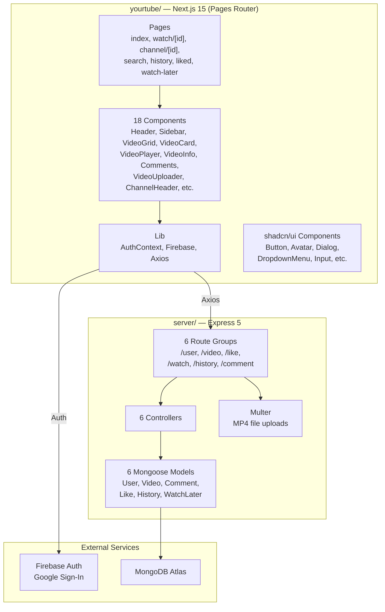

# FlexTube (you_tube2.0) — Codebase Walkthrough

## Overview
A **YouTube clone** called **FlexTube** — a full-stack video platform built as a monorepo with a **Node.js/Express backend** and a **Next.js frontend**.

## Architecture

---

## Tech Stack

| Layer | Technology |
|-------|-----------|
| Frontend | Next.js 15, React 19, TypeScript |
| Styling | Tailwind CSS v4, shadcn/ui, Lucide icons |
| Auth | Firebase (Google Sign-In popup) |
| Backend | Express 5, Node.js (ESM) |
| Database | MongoDB Atlas via Mongoose 8 |
| File Upload | Multer (MP4 only, saved to `uploads/`) |
| HTTP Client | Axios |
| Utilities | date-fns, sonner (toasts), class-variance-authority |

---

## Backend (`server/`)

### Entry Point — [index.js](file:///c:/Users/Devaj/you_tube2.0-main/server/index.js)
Express app with CORS, body-parser, static file serving for `/uploads`, and 6 route groups.

### Models (`Modals/`)

| Model | Key Fields |
|-------|-----------|
| [Auth.js](file:///c:/Users/Devaj/you_tube2.0-main/server/Modals/Auth.js) | email, name, channelname, description, image |
| [video.js](file:///c:/Users/Devaj/you_tube2.0-main/server/Modals/video.js) | videotitle, filename, filepath, filesize, videochanel, Like, views, uploader |
| [comment.js](file:///c:/Users/Devaj/you_tube2.0-main/server/Modals/comment.js) | userid→user, videoid→videofiles, commentbody, usercommented |
| [like.js](file:///c:/Users/Devaj/you_tube2.0-main/server/Modals/like.js) | viewer→user, videoid→videofiles |
| [history.js](file:///c:/Users/Devaj/you_tube2.0-main/server/Modals/history.js) | viewer→user, videoid→videofiles |
| [watchlater.js](file:///c:/Users/Devaj/you_tube2.0-main/server/Modals/watchlater.js) | viewer→user, videoid→videofiles |

### API Routes

| Route | Method | Endpoint | Description |
|-------|--------|----------|-------------|
| Auth | POST | `/user/login` | Create/find user |
| Auth | PATCH | `/user/update/:id` | Update channel name/description |
| Video | POST | `/video/upload` | Upload MP4 via Multer |
| Video | GET | `/video/getall` | Get all videos |
| Like | POST | `/like/:videoId` | Toggle like |
| Like | GET | `/like/:userId` | Get liked videos (populated) |
| Comment | POST | `/comment/postcomment` | Add comment |
| Comment | GET | `/comment/:videoid` | Get comments for video |
| Comment | DELETE | `/comment/deletecomment/:id` | Delete comment |
| Comment | POST | `/comment/editcomment/:id` | Edit comment |
| History | POST | `/history/:videoId` | Add to history + increment views |
| History | POST | `/history/views/:videoId` | Increment views only |
| History | GET | `/history/:userId` | Get watch history (populated) |
| Watch Later | POST | `/watch/:videoId` | Toggle watch later |
| Watch Later | GET | `/watch/:userId` | Get watch later list (populated) |

---

## Frontend (`yourtube/`)

### App Layout — [_app.tsx](file:///c:/Users/Devaj/you_tube2.0-main/yourtube/src/pages/_app.tsx)
Wraps everything in [UserProvider](file:///c:/Users/Devaj/you_tube2.0-main/yourtube/src/lib/AuthContext.js#10-67) (auth context). Layout: **Header** (top) + **Sidebar** (left) + page content.

### Pages

| Page | Route | Description |
|------|-------|-------------|
| [index.tsx](file:///c:/Users/Devaj/you_tube2.0-main/yourtube/src/pages/index.tsx) | `/` | Home — category tabs + video grid |
| [watch/[id]](file:///c:/Users/Devaj/you_tube2.0-main/yourtube/src/pages/watch/%5Bid%5D/index.tsx) | `/watch/:id` | Video player + info + comments + related |
| [channel/[id]](file:///c:/Users/Devaj/you_tube2.0-main/yourtube/src/pages/channel/%5Bid%5D/index.tsx) | `/channel/:id` | Channel page + upload + videos |
| [search](file:///c:/Users/Devaj/you_tube2.0-main/yourtube/src/pages/search/index.tsx) | `/search?q=` | Search results |
| [history](file:///c:/Users/Devaj/you_tube2.0-main/yourtube/src/pages/history/index.tsx) | `/history` | Watch history |
| [liked](file:///c:/Users/Devaj/you_tube2.0-main/yourtube/src/pages/liked/index.tsx) | `/liked` | Liked videos |
| [watch-later](file:///c:/Users/Devaj/you_tube2.0-main/yourtube/src/pages/watch-later/index.tsx) | `/watch-later` | Watch later list |

### Key Components

| Component | Purpose |
|-----------|---------|
| [Header.tsx](file:///c:/Users/Devaj/you_tube2.0-main/yourtube/src/components/Header.tsx) | Top nav — logo, search, sign-in/user menu |
| [Sidebar.tsx](file:///c:/Users/Devaj/you_tube2.0-main/yourtube/src/components/Sidebar.tsx) | Left nav — Home, Explore, History, Liked, etc. |
| [Videogrid.tsx](file:///c:/Users/Devaj/you_tube2.0-main/yourtube/src/components/Videogrid.tsx) | Fetches & displays all videos in a grid |
| [videocard.tsx](file:///c:/Users/Devaj/you_tube2.0-main/yourtube/src/components/videocard.tsx) | Individual video thumbnail card |
| [Videopplayer.tsx](file:///c:/Users/Devaj/you_tube2.0-main/yourtube/src/components/Videopplayer.tsx) | HTML5 video player |
| [VideoInfo.tsx](file:///c:/Users/Devaj/you_tube2.0-main/yourtube/src/components/VideoInfo.tsx) | Like/dislike, watch later, share, views, description |
| [Comments.tsx](file:///c:/Users/Devaj/you_tube2.0-main/yourtube/src/components/Comments.tsx) | Full comment CRUD (add, edit, delete) |
| [VideoUploader.tsx](file:///c:/Users/Devaj/you_tube2.0-main/yourtube/src/components/VideoUploader.tsx) | Drag-and-drop video upload with progress bar |
| [channeldialogue.tsx](file:///c:/Users/Devaj/you_tube2.0-main/yourtube/src/components/channeldialogue.tsx) | Modal for creating/editing channel |
| [SearchResult.tsx](file:///c:/Users/Devaj/you_tube2.0-main/yourtube/src/components/SearchResult.tsx) | Search results display (currently uses hardcoded data) |

### Auth Flow — [AuthContext.js](file:///c:/Users/Devaj/you_tube2.0-main/yourtube/src/lib/AuthContext.js)
1. User clicks "Sign in" → `signInWithPopup` (Firebase Google Auth)
2. Firebase user data sent to `POST /user/login` → backend creates/returns user
3. User stored in React context + `localStorage`
4. `onAuthStateChanged` auto-restores session on refresh

### Config
- [firebase.js](file:///c:/Users/Devaj/you_tube2.0-main/yourtube/src/lib/firebase.js) — Firebase config + GoogleAuthProvider
- [axiosinstance.js](file:///c:/Users/Devaj/you_tube2.0-main/yourtube/src/lib/axiosinstance.js) — Axios baseURL from `process.env.BACKEND_URL`
- [.env](file:///c:/Users/Devaj/you_tube2.0-main/yourtube/.env) — `BACKEND_URL` env var

---

## Notable Observations

> [!NOTE]
> - **Search** currently uses hardcoded mock data instead of the backend API
> - **Channel page** uses hardcoded video data instead of fetching by uploader
> - The video model has a **duplicate [filename](file:///c:/Users/Devaj/you_tube2.0-main/server/filehelper/filehelper.js#7-13) field** definition
> - [axiosinstance.js](file:///c:/Users/Devaj/you_tube2.0-main/yourtube/src/lib/axiosinstance.js) uses `process.env.BACKEND_URL` (needs `NEXT_PUBLIC_` prefix for client-side)
> - Folder named `Modals/` (likely intended as `Models/`)
> - No subscription system implemented yet (button exists but no backend)
> - Category tabs are UI-only, no filtering logic connected
